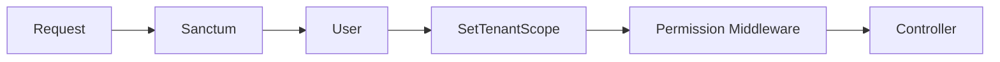
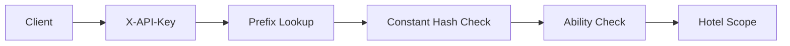

# API Authentication

## Sanctum

- `/api/v1/*` routes use `auth:sanctum`.
- Stateful Sanctum middleware is configured in the API middleware group for same-domain browser API use.
- Token-authenticated requests derive hotel scope from the authenticated user, not from submitted `hotel_id`.
- Scanner requests also require web-guard `redemption.scan` and an endpoint-specific token ability.

## Scanner API

- `POST /api/v1/scanner/validate`
- `POST /api/v1/scanner/redeem`

Both require:

- Authenticated Sanctum user
- Active hotel context
- `redemption.scan`
- `scanner:validate` for validation or `scanner:redeem` for redemption
- Form Request validation
- Scanner rate limiting

Inactive users, inactive hotels, missing token ability, revoked tokens, and cross-hotel QR/session combinations are covered by Phase 5 feature tests.

## Integration API Key Foundation

`IntegrationApiKeyService` creates and validates hotel-scoped API keys.

- Raw secret format: `{prefix}.{secret}`
- Stored value: hashed secret only
- Lookup value: `key_prefix`
- Supported controls: abilities, expiration, revocation, last-used timestamp

## HMAC Decision

HMAC request signing is deferred to Phase 7. The planned headers are `X-API-Key`, `X-Timestamp`, `X-Nonce`, and `X-Signature`, with canonicalized method, path, timestamp, nonce, and body hash.
