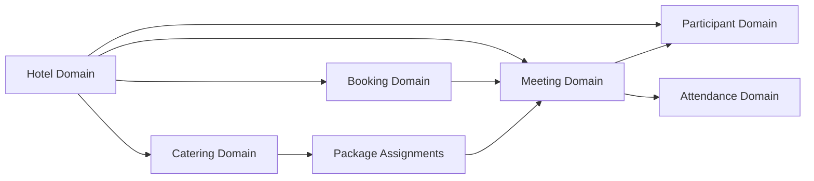
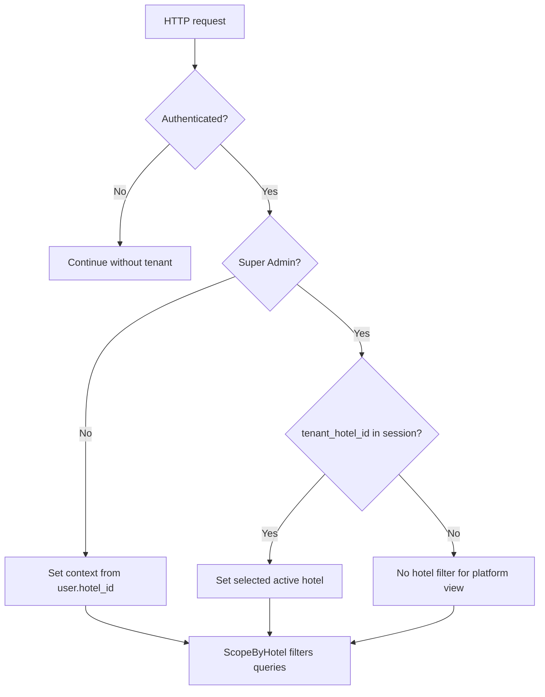
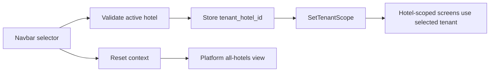
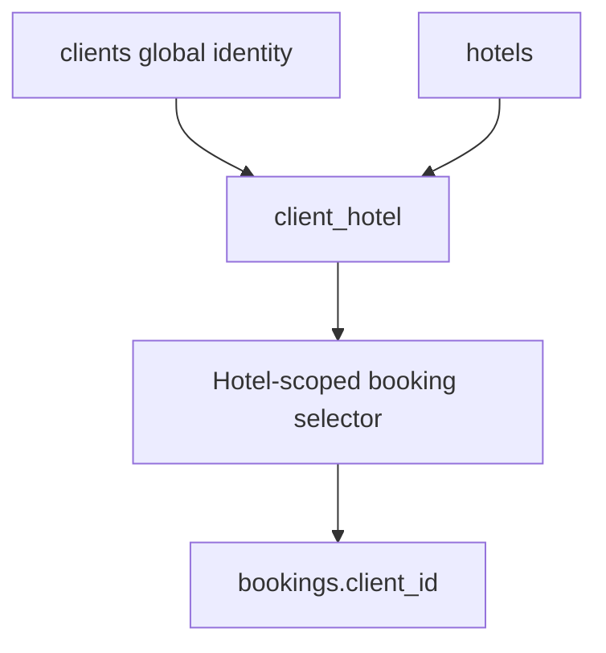

# Architecture

## Phase 3 Domain Structure

The application keeps the existing Laravel, Bootstrap 4, jQuery, Ample Admin, and `core.js` partial-view flow. Phase 3 adds canonical domain modules beside legacy compatibility code.

```text
app/
  Domain/
    Hotel/
    Booking/
    Meeting/
    Catering/
    Participant/
    Attendance/
  Actions/
  Services/
  Policies/
  Support/Tenancy/
```

## Domain Modules



## Tenant Resolution

Normal users are scoped to `users.hotel_id`. Super admins use `tenant_hotel_id` in the session when they intentionally switch context. Without a selected tenant, super admins can view all tenant data.



## Super-Admin Switching



## UI/UX Remediation Layer

Canonical domain pages continue to render as `core.js` partials inside `layouts.app`. Shared partials now provide the dashboard-style shell:

- `domain._page_header`
- `domain._card`
- `domain._validation_summary`
- `domain._form_actions`
- `domain._datatable`

The navbar displays the active hotel code for all authenticated users. Super-admins can switch or reset tenant context from the header or `/tenant-switch`; failed switches keep the previous context.

## Client Hotel Associations

Clients now use a compatibility model: `clients` stores the global client identity and legacy primary hotel, while `client_hotel` stores hotel associations. `clients.hotel_id` remains for backward compatibility during migration, but booking selectors and normal hotel lists use `client_hotel`.



## Compatibility Layer

Legacy tables and routes remain for backward compatibility:

- `m_client`
- `m_meeting_rooms`
- `m_packages`
- `trx_meeting_schedule`
- `trx_meeting_attendance`

Canonical Phase 3 routes use domain models and canonical attributes. Legacy routes are retained and documented for gradual removal after canonical UI adoption is stable.

## Phase 4 QR And Redemption

Phase 4 adds `App\Domain\QRCode`, `App\Domain\Redemption`, and catering `MealSession` workflows. Controllers delegate token lifecycle, entitlement generation, idempotency, and redemption mutation to services/actions. Scanner mutation uses PostgreSQL row locks and a partial unique redemption index.

Final Phase 4 remediation adds safe persisted rejected attempts, append-only override records linked by `redemptions.original_redemption_id`, a browser camera scanner module using `html5-qrcode`, and `ParticipantQRCodeController` for operational participant QR lifecycle management. The true concurrency test uses two independent Artisan worker processes and PostgreSQL locks rather than sequential duplicate checks.
# Phase 6 Dashboard And Reporting Architecture

Dashboard controllers remain thin and delegate operational queries to `DashboardMetricsService`, `DashboardAlertService`, and `DashboardFilterData`. Reports use `ReportFilter`, `HotelTimezoneService`, `ReportQueryService`, and `ReportExportService` so web views and exports share the same tenant-safe query definitions.

Queued exports store only a `report_exports` ID in the job payload. The job reconstructs validated filters from the export record and writes files to private local storage.
