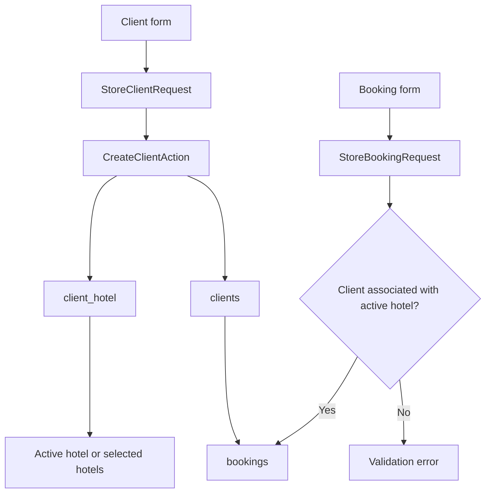
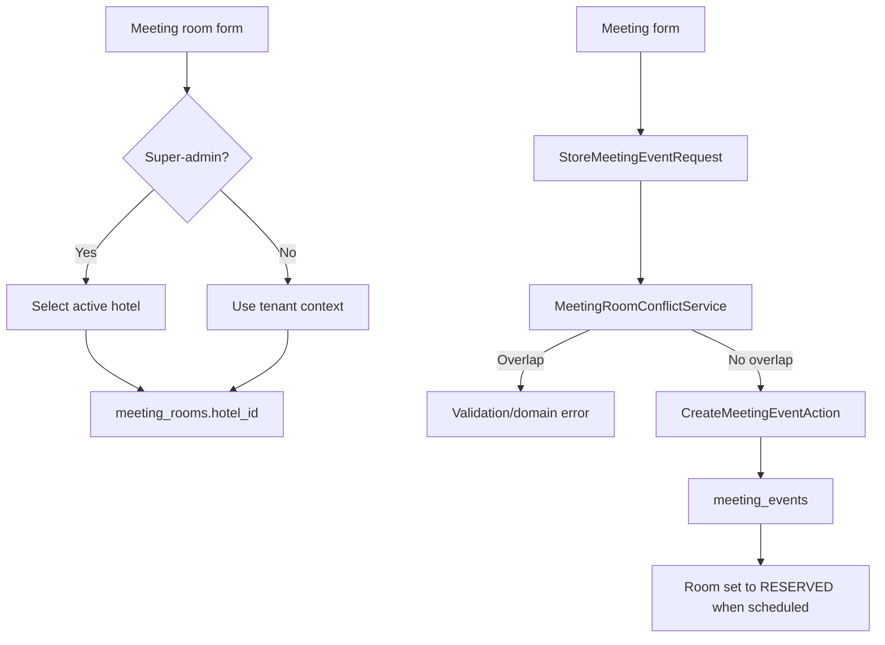
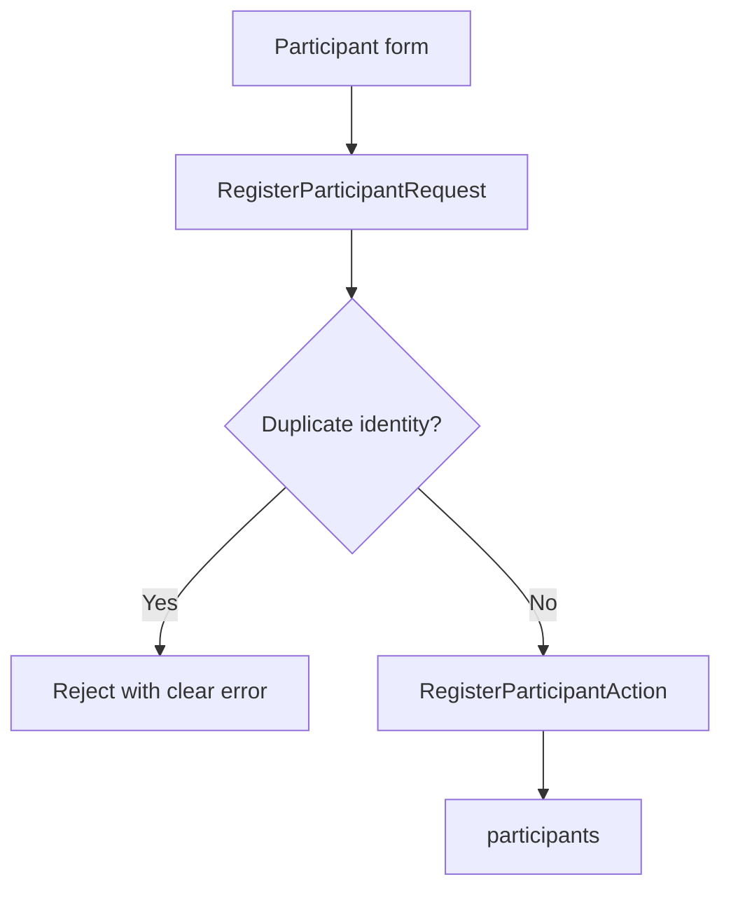
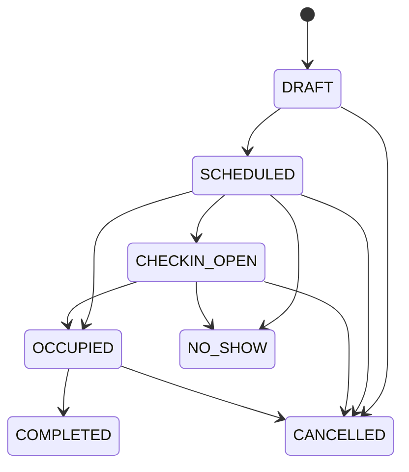
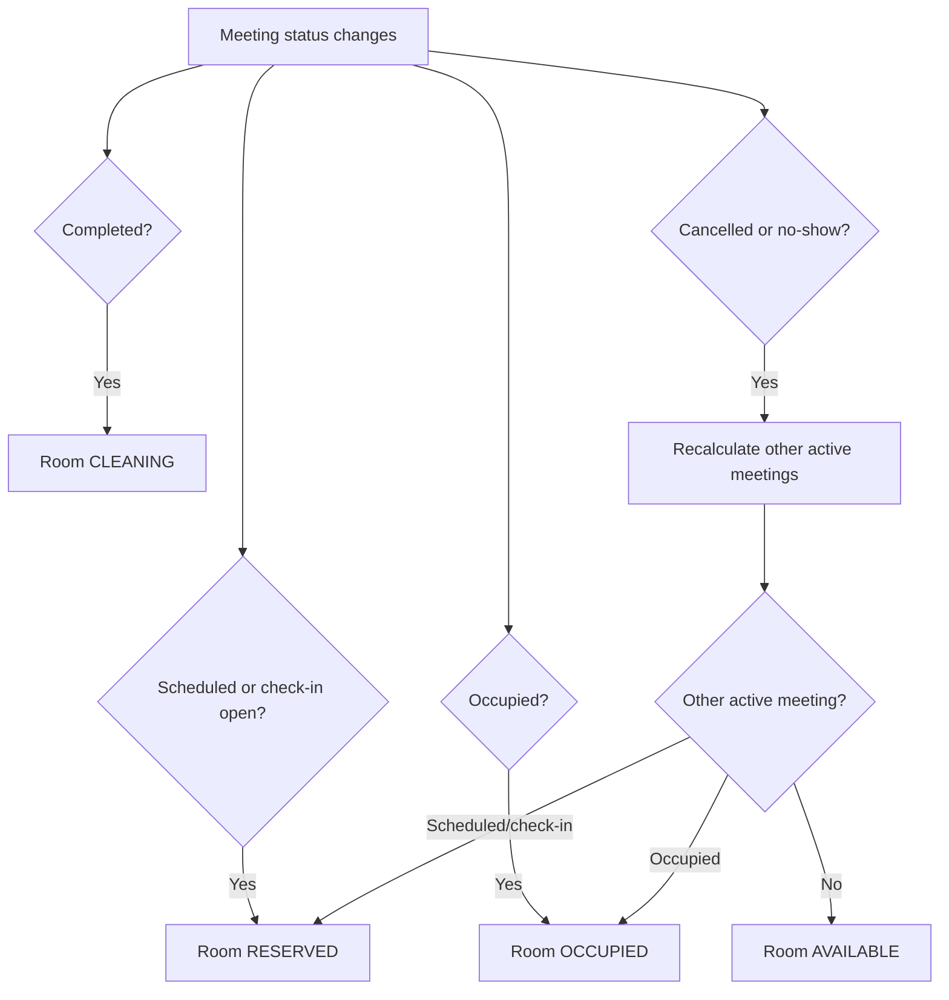
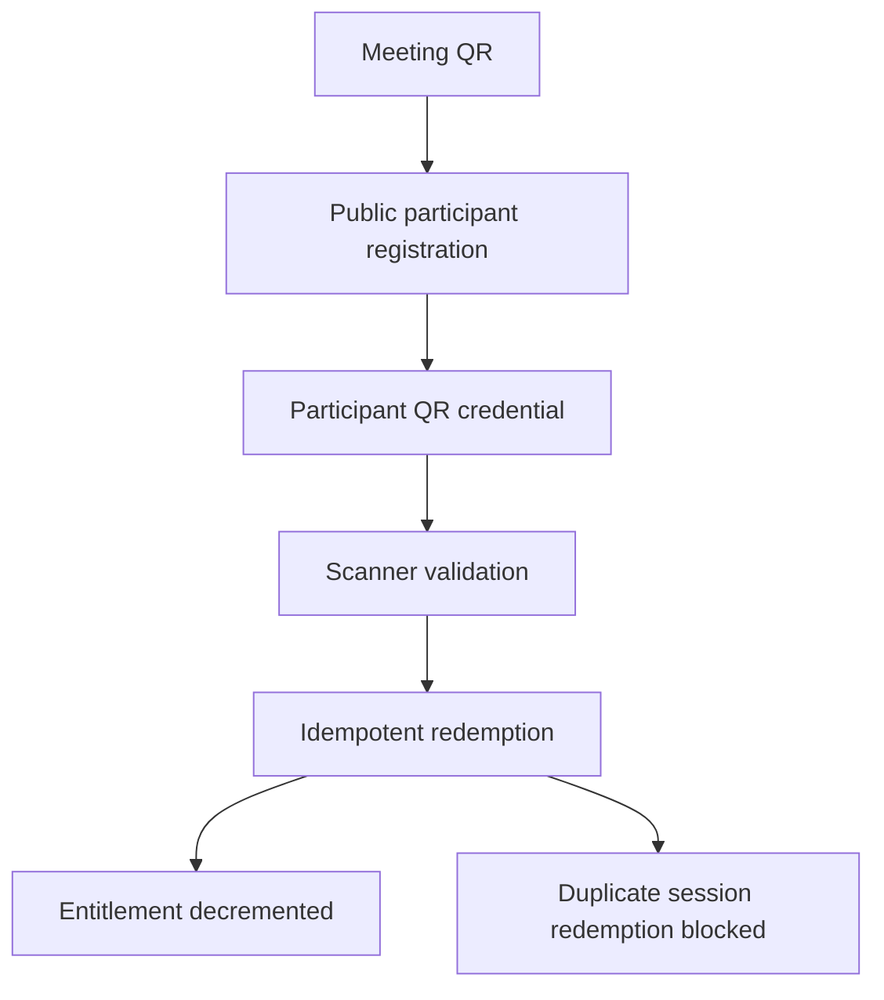

# Business Flow

## Client And Booking



Clients can be associated with multiple hotels. Normal hotel users create or view only clients associated with their active hotel. Super-admins may associate a client with multiple active hotels.

## Meeting Creation And Room Conflict



Conflict rule:

```text
existing.start_at < requested.end_at
AND existing.end_at > requested.start_at
```

Cancelled and no-show meetings are excluded.

## Participant Registration



Duplicate detection uses normalized email, normalized phone, or identity reference within the same meeting.

## Meeting Lifecycle



Terminal recovery from `COMPLETED`, `CANCELLED`, or `NO_SHOW` through normal forms is forbidden in Phase 3. A future administrative recovery action requires a separate permission, reason, audit trail, conflict revalidation, and room recalculation.

## Room Status Synchronization



## QR Redemption



Operational rejected scans with known participant, meeting, session, and tenant context are persisted as rejected redemptions when the rejection can be reviewed by staff. Approved override creates a linked `OVERRIDDEN` redemption and consumes entitlement once. Invalid QR, wrong-hotel, unresolved, authentication, authorization, and malformed attempts remain audit-only.

Participant QR administration supports generate, rotate, and revoke. Rotation is the standard lost-QR procedure because raw QR tokens are never stored and old QR images cannot be reconstructed.
