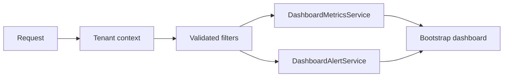
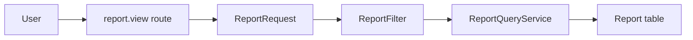
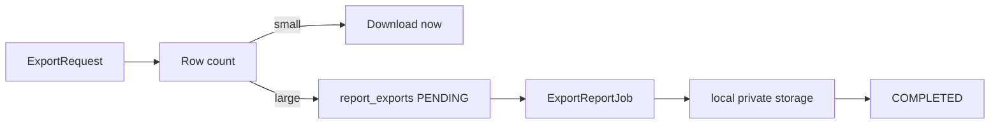
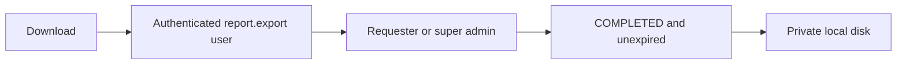
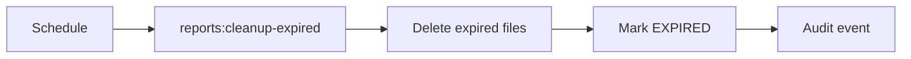

# Dashboard And Reporting

## Dashboard Query Flow

Dashboard data is queried from canonical Phase 3 and Phase 4 tables. Normal users are forced to their active hotel. Super admins may view all authorized hotels or filter to a selected active hotel.

## Metrics

- Meetings today: meetings whose `start_at` falls inside the selected hotel's local day.
- Upcoming meetings: next `REPORTS_UPCOMING_HOURS`, default 24 hours.
- Attendance percentage: checked-in participants divided by expected participants, with zero expected participants returning 0.
- Redemption counts: `SUCCESS` and `OVERRIDDEN` count as consumed. `REVERSED` is preserved as history and not counted as current consumption.

## Alerts

- Starting soon: scheduled or check-in-open meetings within `REPORTS_STARTING_SOON_MINUTES`, default 60 minutes.
- Running beyond schedule: `OCCUPIED` meetings where hotel-local current time has passed `end_at`.
- Room conflicts: overlapping non-cancelled/non-no-show meetings. This is a warning only; database exclusion constraints remain authoritative.
- Over capacity: active participants exceed expected participants.
- Open meal sessions: `OPEN` meal sessions.
- Recent scanner failures: persisted `REJECTED` redemptions from the recent scanner-failure window.

## Timezone Strategy

All date filters are interpreted in the selected or active hotel timezone and converted to UTC boundaries for database comparisons. Super-admin all-hotel reports fall back to the application timezone for filter boundaries while each row is displayed in its row hotel timezone where available.

## Reports

The report module implements:

- Meeting report
- Participant attendance report
- Redemption report
- Package consumption report
- Room utilization report

Each report shares tenant-safe filters and has web, Excel, CSV, and PDF export support.

## Report Request Flow

## Export Lifecycle

Synchronous thresholds are configured in `config/reports.php`: Excel 1000 rows, CSV 5000 rows, PDF 250 rows. Large exports are queued and tracked in `report_exports`.

## Secure Download Flow

Downloads never expose raw storage paths. Spreadsheet formula-like values beginning with `=`, `+`, `-`, or `@` are escaped.

## Cleanup Flow

Cleanup runs daily at 02:30. Notifications are deferred; download availability is provided through the Export Center UI.
