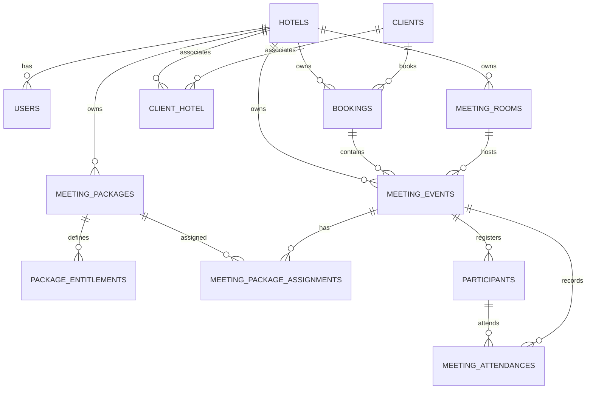

# Database Schema

## Canonical Phase 3 Tables

| Table | Purpose |
|---|---|
| `hotels` | Tenant/hotel master data |
| `users.hotel_id` | Normal user tenant assignment |
| `meeting_rooms` | Hotel-scoped rooms |
| `clients` | Client identity records with transitional primary hotel |
| `client_hotel` | Many-to-many client hotel associations |
| `bookings` | Booking aggregate linked to client |
| `meeting_events` | Scheduled meeting/event records |
| `meeting_packages` | Hotel-scoped package definitions |
| `package_entitlements` | Package entitlement definitions |
| `meeting_package_assignments` | Package assignments per meeting |
| `participants` | Participant identity and registration |
| `meeting_attendances` | Meeting attendance events |
| `participant_qr_credentials` | Hash-only participant QR credentials |
| `meal_sessions` | Open/closed meal sessions per meeting entitlement |
| `participant_entitlements` | Participant entitlement balances |
| `redemptions` | Scanner redemption history |
| `scanner_idempotency_keys` | Idempotent scanner response cache |
| `audit_logs` | Phase 4 critical event audit records |

## ER Diagram

## PostgreSQL Constraints

- `meeting_rooms`: unique `hotel_id + code`.
- `clients`: unique `hotel_id + external_id`.
- `client_hotel`: unique `client_id + hotel_id`; active associations drive tenant-scoped client lists and booking selectors.
- `bookings`: unique `hotel_id + booking_number`; partial unique external reference for non-null external IDs.
- `meeting_events`: check `end_at > start_at`.
- `meeting_events`: partial exclusion constraint on active room time ranges using `btree_gist` and `tstzrange(start_at, end_at, '[)')`.
- `participants`: partial unique indexes for normalized email, normalized phone, and identity reference per meeting.
- `meeting_attendances`: partial unique index preventing duplicate meeting check-in per participant.
- `participant_qr_credentials`: unique `token_hash`; partial unique active credential per participant.
- `meal_sessions`: check `ends_at > starts_at`; unique `meeting_event_id + entitlement_type + session_number`.
- `participant_entitlements`: unique `participant_id + meeting_event_id + entitlement_type`; check `remaining_quantity = total_quantity - redeemed_quantity`.
- `redemptions`: partial unique active success per `participant_id + meal_session_id` where status is `SUCCESS` or `OVERRIDDEN`.
- `redemptions.original_redemption_id`: nullable self-reference from append-only override records to the original rejected attempt.
- `redemptions_rejected_idempotency_once`: partial unique idempotency guard for persisted `REJECTED` attempts with an idempotency key.
- `scanner_idempotency_keys`: unique `hotel_id + idempotency_key`.

## Legacy Tables Preserved

Legacy tables remain for compatibility and rollback:

- `m_client`
- `m_meeting_rooms`
- `r_room_status`
- `m_packages`
- `trx_meeting_schedule`
- `trx_meeting_attendance`
- `qr_detail`
