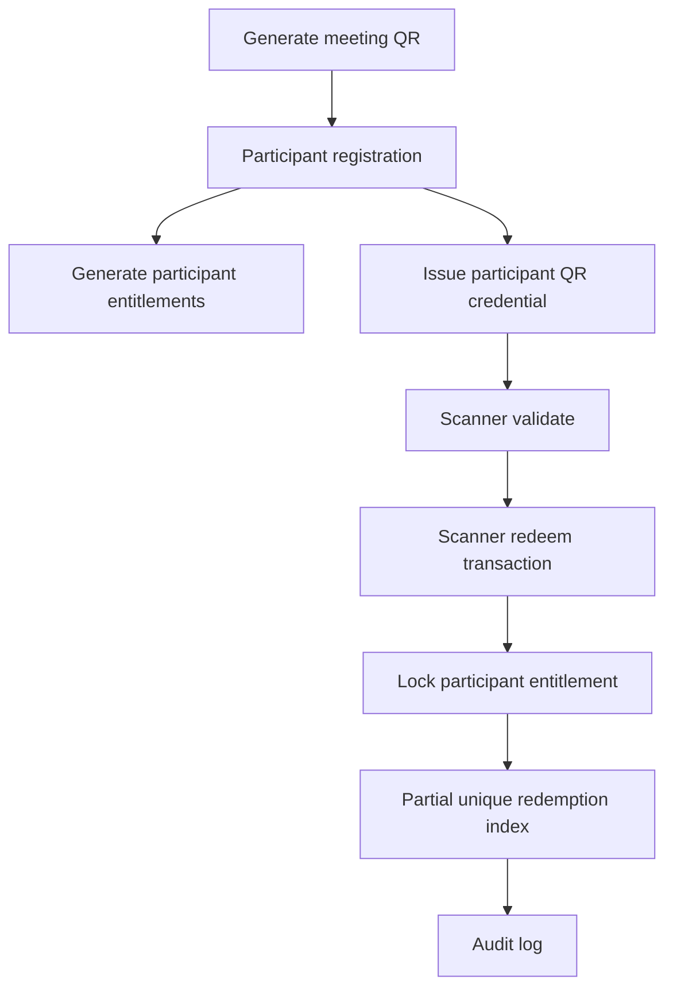
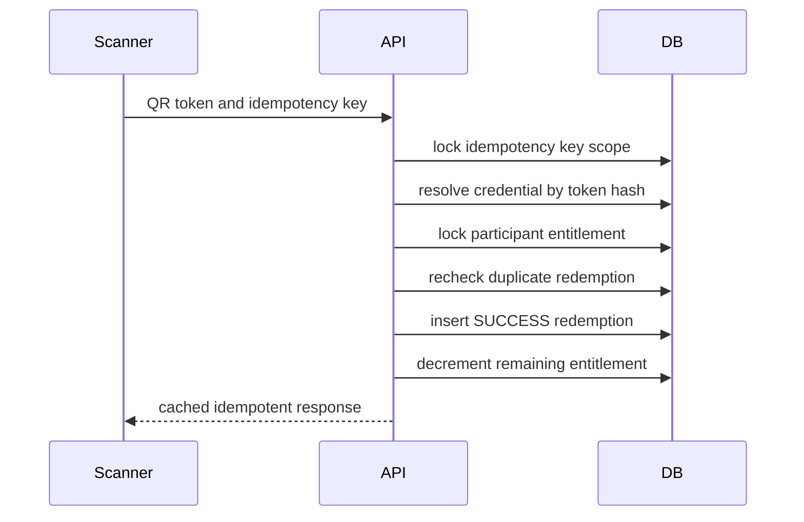
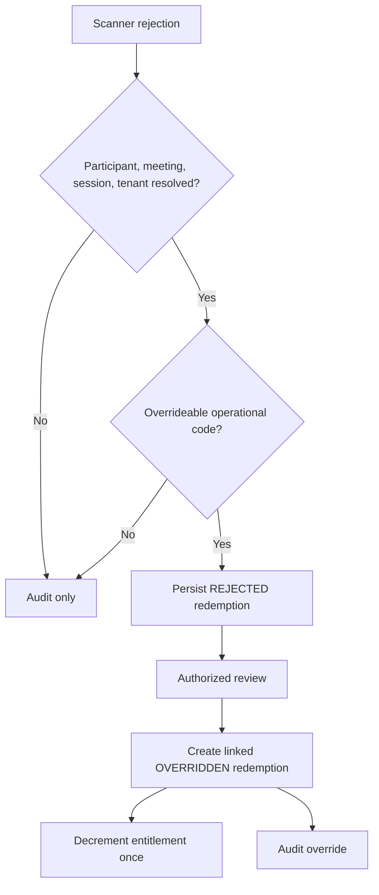
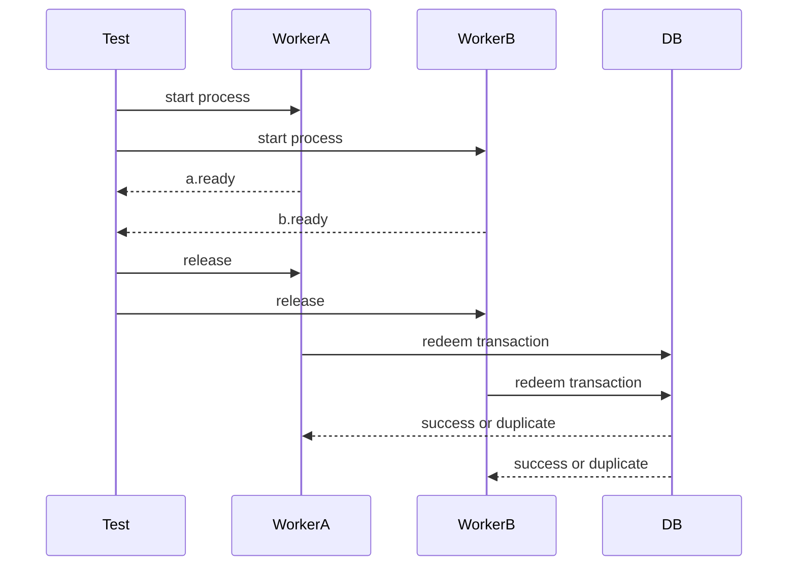
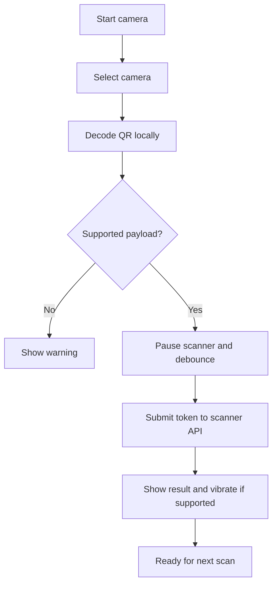
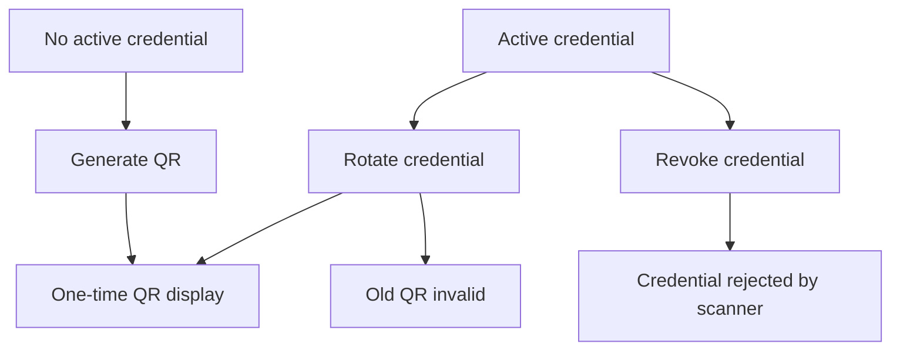

# QR and Redemption

Phase 4 adds hash-only meeting QR tokens, participant QR credentials, meal sessions, participant entitlements, scanner validation, idempotent redemption, reversal support, and audit records.

## Token Storage

Raw QR tokens are generated with 32 random bytes and URL-safe base64. Only SHA-256 hashes and last-four identifiers are stored. Meeting QR SVG files are generated at issuance time and stored under the public disk path saved on `meeting_events.meeting_qr_path`.

## Flow



## Redemption Transaction



## Idempotency

`scanner_idempotency_keys` is unique by `hotel_id + idempotency_key`. The stored request hash masks QR data by hashing the submitted token before hashing the payload. Same key and same request returns the cached response. Same key and different request returns `DUPLICATE_REQUEST`.

## Duplicate Prevention

Duplicate success is blocked by application checks before and after `lockForUpdate()`, and by PostgreSQL partial unique index:

```text
redemptions_one_active_success
ON redemptions (participant_id, meal_session_id)
WHERE status IN ('SUCCESS', 'OVERRIDDEN')
```

`REVERSED` and `REJECTED` rows do not block a later valid redemption.

## Override And Reversal

Reversal marks an active success or override as `REVERSED`, restores entitlement counters inside a transaction, and records audit metadata.

Override is append-only. The original `REJECTED` redemption remains unchanged, and a new `OVERRIDDEN` redemption links back through `original_redemption_id`. The override transaction locks the rejected row, locks the participant entitlement, rechecks active successful redemptions, decrements entitlement once, and audits success or rejection.

Overrideable persisted codes are `SESSION_NOT_OPEN`, `SESSION_EXPIRED`, `NO_ENTITLEMENT`, `ALREADY_REDEEMED`, `QUOTA_EXHAUSTED`, and `MEETING_COMPLETED`.

Audit-only or non-overrideable codes are `INVALID_QR`, `QR_EXPIRED`, `QR_REVOKED`, `WRONG_HOTEL`, `WRONG_MEETING`, `PARTICIPANT_BLOCKED`, `MEETING_CANCELLED`, authentication failures, authorization failures, malformed requests, and unresolved participant/session scans.



## True Concurrency Test

`tests/Feature/PhaseFourConcurrencyTest.php` uses PostgreSQL and two separate PHP processes. Each process runs `php artisan scanner:concurrent-redemption-worker` with a different idempotency key for the same participant, meal session, and entitlement. The workers create `a.ready` and `b.ready` files in a temporary barrier directory, wait for a `release` file, then execute the redemption action at nearly the same time.

Expected result: one HTTP 200-style action result, one `ALREADY_REDEEMED` or `DUPLICATE_REQUEST` rejection, one active successful redemption row, `redeemed_quantity = 1`, and `remaining_quantity = 0`.



Run locally and in CI with:

```bash
php artisan test tests/Feature/PhaseFourConcurrencyTest.php
```

The test requires PostgreSQL; SQLite is not supported because row locks and partial unique indexes are part of the behavior under test.

## Camera Scanner

The scanner page uses `html5-qrcode` 2.3.8, Apache-2.0 licensed, through Vite. Frames are decoded in the browser and are not sent to an external service. Supported targets are modern desktop browsers, Android Chrome, and iOS Safari where camera APIs are available. Production camera access requires HTTPS except for localhost development.

The scanner accepts only raw opaque participant tokens or same-origin URLs matching `/scan/participant/{token}`. Arbitrary URLs, script-like payloads, and unsupported route shapes are rejected. Camera tracks are stopped on explicit stop, successful decode, and page unload. Manual token input remains available.



Manual hardware verification: open `/scanner` over HTTPS, grant camera permission, select the rear camera where available, scan a freshly issued participant QR, verify success/failure feedback, then stop the camera and confirm the browser camera indicator turns off.

## Participant QR Administration

Routes:

```text
GET  /participants/{participant}/qr
POST /participants/{participant}/qr/generate
POST /participants/{participant}/qr/rotate
POST /participants/{participant}/qr/revoke
```

Routes require auth, tenant middleware, `participant.qr.manage`, and participant policy checks. The screen shows participant, meeting, hotel, active credential status, token last four, issue/expiry/revocation timestamps, and lifecycle history.

Generate is allowed when no active credential exists. Rotate revokes the active credential and issues a new one. Revoke invalidates the active credential. Raw QR token and QR image are shown only in the immediate flash response after generation or rotation; old QR images cannot be reconstructed because only token hashes are stored.


